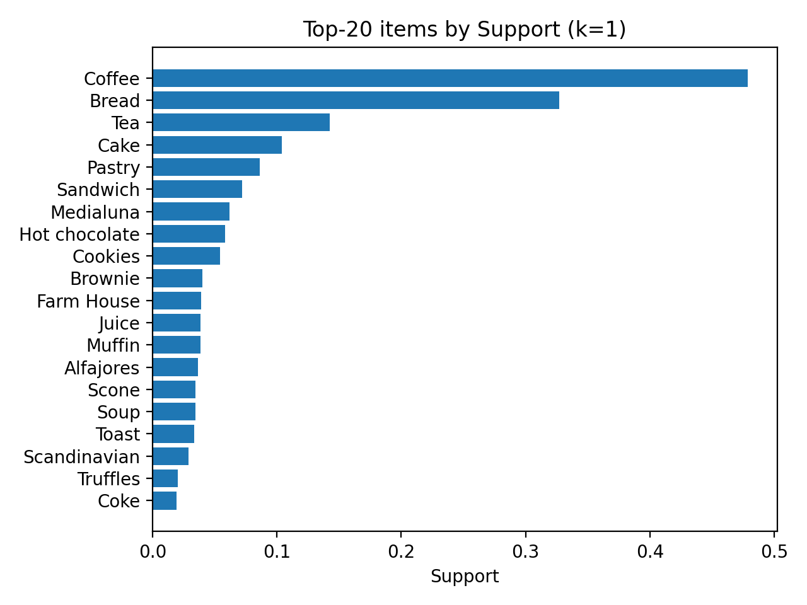
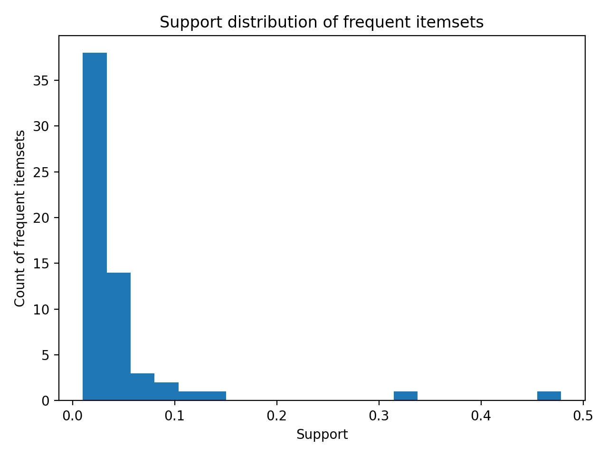

# Market Basket Analysis using Association Rule Mining (Apriori & FP-Growth)

This repository contains a comprehensive Data Mining project focused on **Market Basket Analysis (MBA)** leveraging a bakery transaction dataset. The project implements, optimizes, and contrasts two foundational frequent itemset mining algorithms: **Apriori** and **FP-Growth (Frequent Pattern Growth)**, to uncover hidden purchasing patterns and association rules among products.

The entire pipeline is engineered mathematically to filter and evaluate rules using core data mining metrics: **Support**, **Confidence**, and **Lift**.

---

## 🚀 Key Pipeline Features & Methodology

1. **Data Preprocessing & One-Hot Encoding:**
   - Processed transactional data into a binary sparse matrix (One-Hot Encoded format) suitable for transaction mining engines.
   
2. **Frequent Itemset Generation:**
   - Evaluated product popularity distributions.
   - Deployed **Apriori** and **FP-Growth** algorithms under various minimum Support thresholds ($Min\_Support$) to find frequent itemsets.

3. **Association Rule Extraction & Pruning:**
   - Generated actionable rules based on conditional probability metrics:
     - **Support ($Supp$):** Prevalence of itemsets across all transactions.
     - **Confidence ($Conf$):** Conditional probability of buying item $Y$ given item $X$: $P(Y|X) = \frac{Supp(X \cup Y)}{Supp(X)}$.
     - **Lift:** The strength of a rule over random co-occurrence: $Lift(X \rightarrow Y) = \frac{Supp(X \cup Y)}{Supp(X) \times Supp(Y)}$. Rules with $Lift > 1$ indicate a strong positive correlation.

4. **Performance Comparison:**
   - Benchmarked execution time efficiency and memory scalability between Apriori and FP-Growth as the support threshold decreases.

---

## 📊 Visualizations & Data Insights

### 1. Item Popularity & Support Distribution
*Analysis of the most frequently purchased single items and the overall distribution of frequent itemsets.*
- **Coffee** and **Bread** emerge as the absolute market leaders in support metrics.
- The frequency histogram illustrates exponential decay as itemset sizes increase, adhering to standard real-world transaction distributions.

<p align="center">
  
  
</p>

---

## 💻 How to Run This Project

Follow these steps to clone the repository and execute the data mining pipeline on your local machine:

### 1. Clone the Repository
Open your terminal or command prompt and run:
```bash
git clone [https://github.com/mrhashx/market-basket-analysis.git](https://github.com/mrhashx/market-basket-analysis.git)
cd market-basket-analysis
```

### 2. Install Dependencies
Ensure you have Python installed, then install the required data science and data mining libraries:
```Bash
pip install pandas mlxtend matplotlib seaborn
```
### 3. Run the Pipeline
Execute the main Python script to generate the frequent itemsets, extract association rules, and output the visualization plots into the images/ directory:
```Bash
python market_basket_analysis.py
```

(Note: If you are using a Jupyter Notebook, simply open the .ipynb file and run all cells sequentially).

### 🛠️ Tech Stack & Dependencies
Language: Python 3.x

Data Engines: Pandas, NumPy

Data Mining Framework: MLxtend (apriori, fpgrowth, association_rules)

Visualization: Matplotlib, Seaborn

